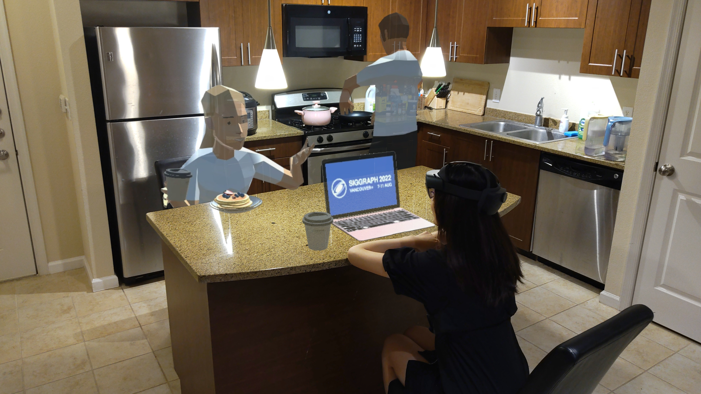

# Interactive Augmented Reality Storytelling Guided by Scene Semantics

    

 
This repository is the implementation for our SIGGRAPH 2022 paper: "Interactive Augmented Reality Storytelling Guided by Scene Semantics"

[Project page](https://changyangli.github.io/projects/siggraph22arstorytelling/) [Paper](https://changyangli.github.io/assets/paper/sig22arstorytelling.pdf) [Video](https://www.youtube.com/watch?v=LGzH2LikEUw&feature=youtu.be)

[Changyang Li](https://changyangli.github.io/), Wanwan Li, [Haikun Huang](https://quincyhuang.github.io/Webpage/), [Lap-Fai Yu](https://craigyuyu.github.io/home/)

-----------

## Introduction
  We present a novel interactive augmented reality (AR) storytelling approach guided by indoor scene semantics. Our approach automatically populates virtual contents in real-world environments to deliver AR stories, which match both the story plots and scene semantics. During the storytelling process, a player can participate as a character in the story. Meanwhile, the behaviors of the virtual characters and the placement of the virtual items adapt to the player's actions.

## Citation

    @article{arstorytelling,
        title={Interactive Augmented Reality Storytelling Guided by Scene Semantics},
        author = {Changyang Li and Wanwan Li and Haikun Huang and Lap-Fai Yu},
        journal = {ACM Transactions on Graphics (TOG)},
        volume = {41},
        number = {4},
        year = {2022},
        publisher={ACM New York, NY, USA}
    }

